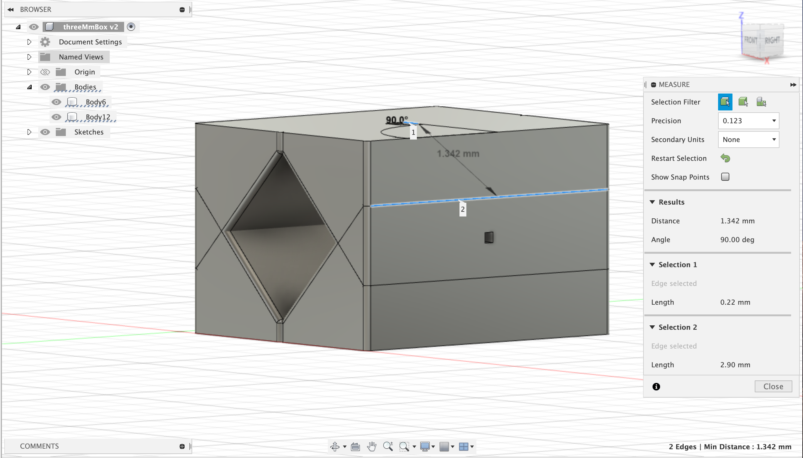

# Assignment 1

Model something that fits inside a 3″x 3″x 3″ cube using at least 5 commands we covered this week and post screenshots on your blog with dimensions.

1. Draft

I first created a box which I then used the draft command to give it the slanted edge.

2. Mirror

After creating the slanted edge, I used the mirror command to reflect it over for the bottom half of the box. Later on, I usedd the mirror command after the fillet tool to copy the top half of the box.

3. Fillet

I used the fillet command to smooth out the edges.

4. Extrude

The extrude command allowed me to cut out parts of the box as seen in the holes on the sides of the box.

5. Chamfer

The last command that I used was the chamfer command that removed the edges from one of the holes.

