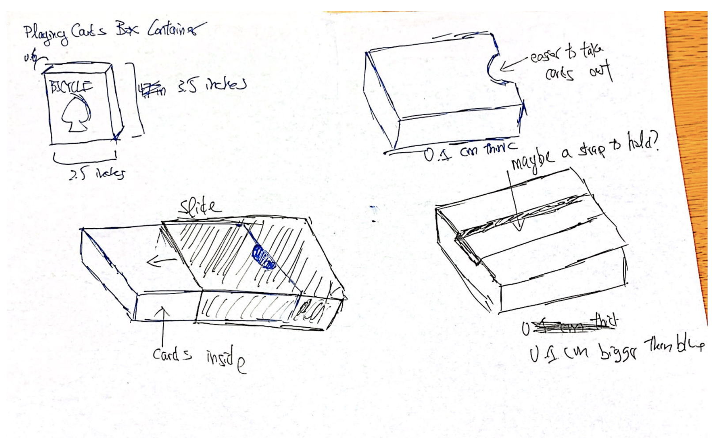
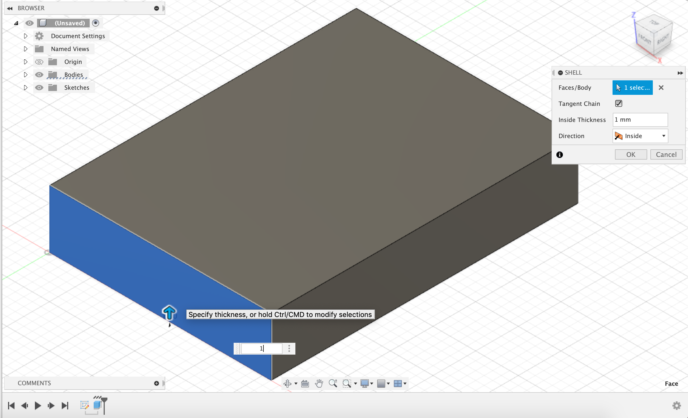
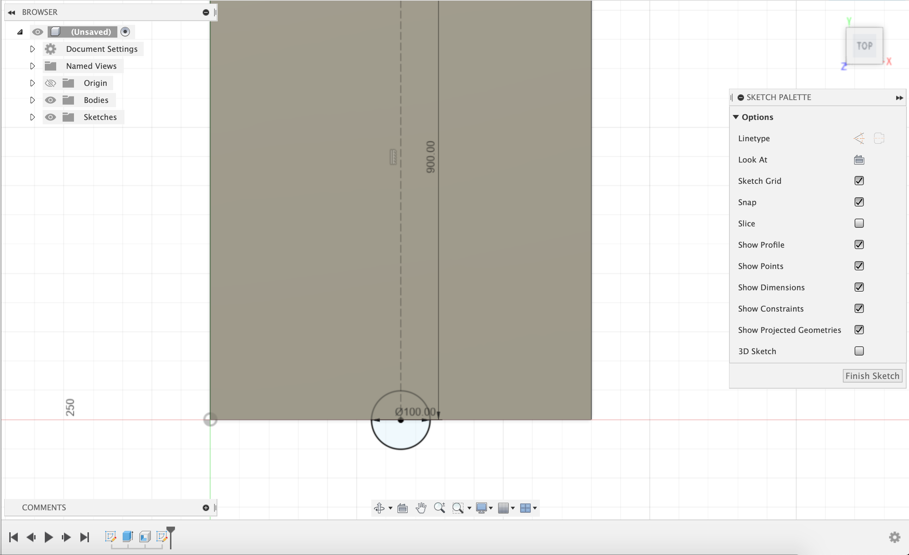
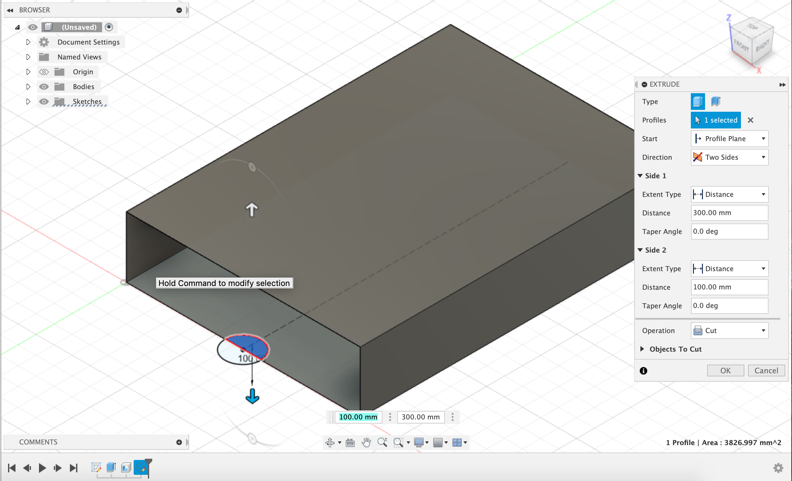
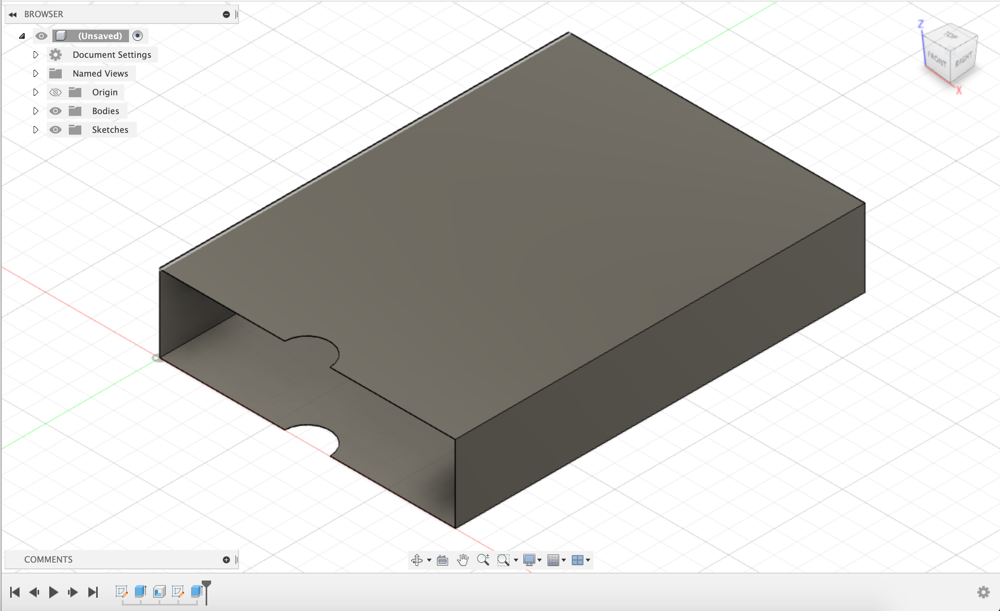
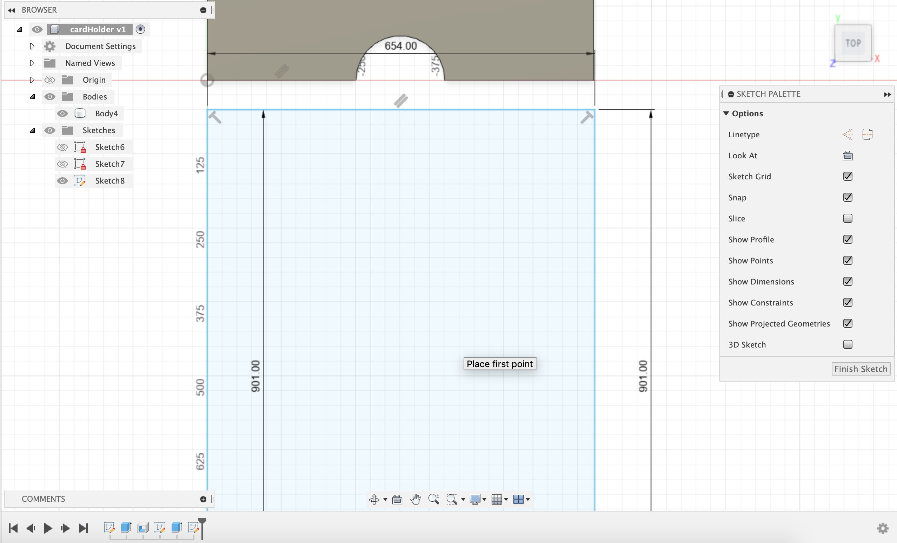
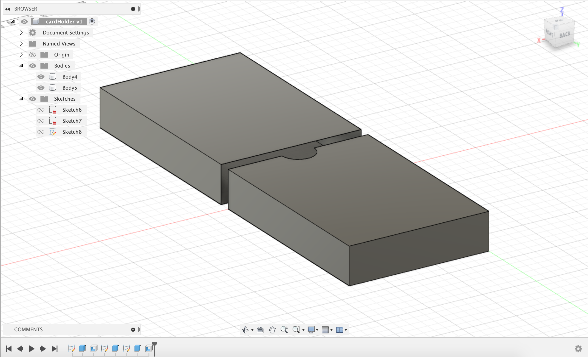
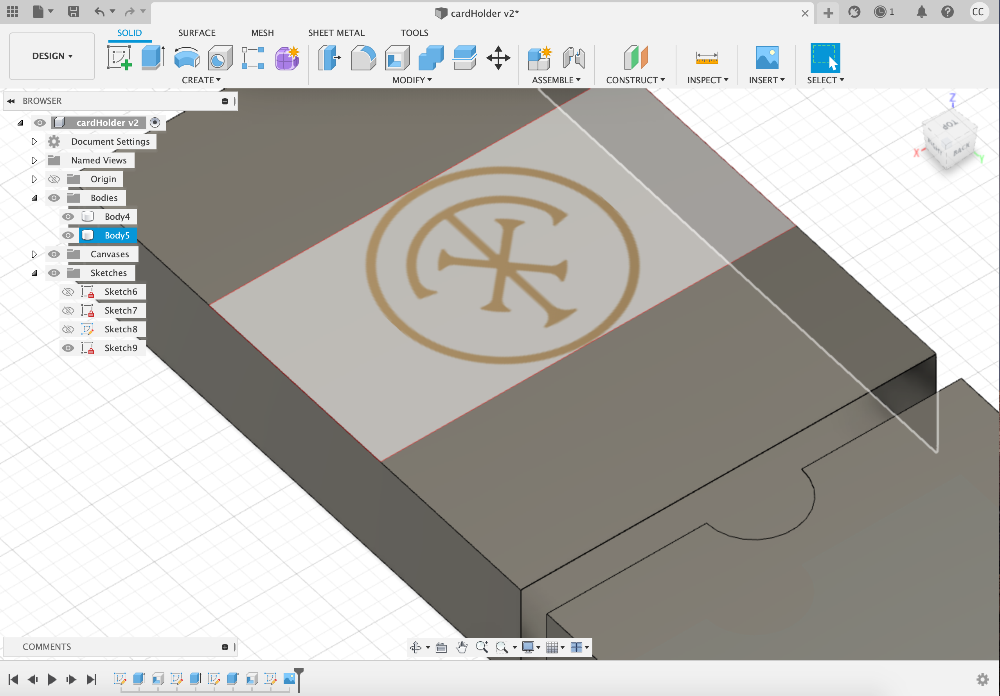

# Assignment 2

Model an object (can be useful or just for fun) that is composed of at least 2 parts that fit together.

1. Idea

The initial idea that I had was a box to hold a pack of cards. I've had issues with leaky water bottles that happened to ruin my cards. This card box serves to keep the cards in good shape and to protect it from outside elements. The inital sketches are attached below. I wanted to create slide boxes that would perfectly fit not only the cards but each other. 

2. Planning

To plan this project, I had to obtain a few measurements of a playing card box. The dimensions that I obtained were around 8.8cm x 6.5cm x 1.7cm. To adjust for the material width (1mm), the dimensions I used for the first box were 9cm x 6.52cm x 1.72cm and the second box was 9cm x 6.54cm x 1.74cm. 

3. Modeling

I first started by sketching out the rectangle for the first box. I then extruded it and applied the shell onto one of the shorter sides. The width is 1mm thick. 

I then drew the circle on the first box. To ensure that this would be responsive to change, I added a construction line with the constraint set to the midpoint. I drew the circle on that midpoint and then used it to cut the hole seen below. 

The finished screenshot of the first box is below. 

I then made the second box which was slightly bigger than the first box. 

I added the logo to the box via insert but I'm not sure if I'm supposed to design and make it on Fusion 360. 

