# Assignment 3

Find an object and make something in 3D to add on to it with measurements (i.e. a creative lid for a cup, an add-on for your phone or DSLR camera).

1. Idea

I've been cooking a lot recently and I've had a problem with measuring things, especially liquids (soy sauce, oyster sauce, etc.). I don't have any measuring spoons so I've had to eyeball the amount listed in recipes. Thus, I wanted to make a simple tablespoon measuring cup (around 15 ml) that I can attach to my cup.

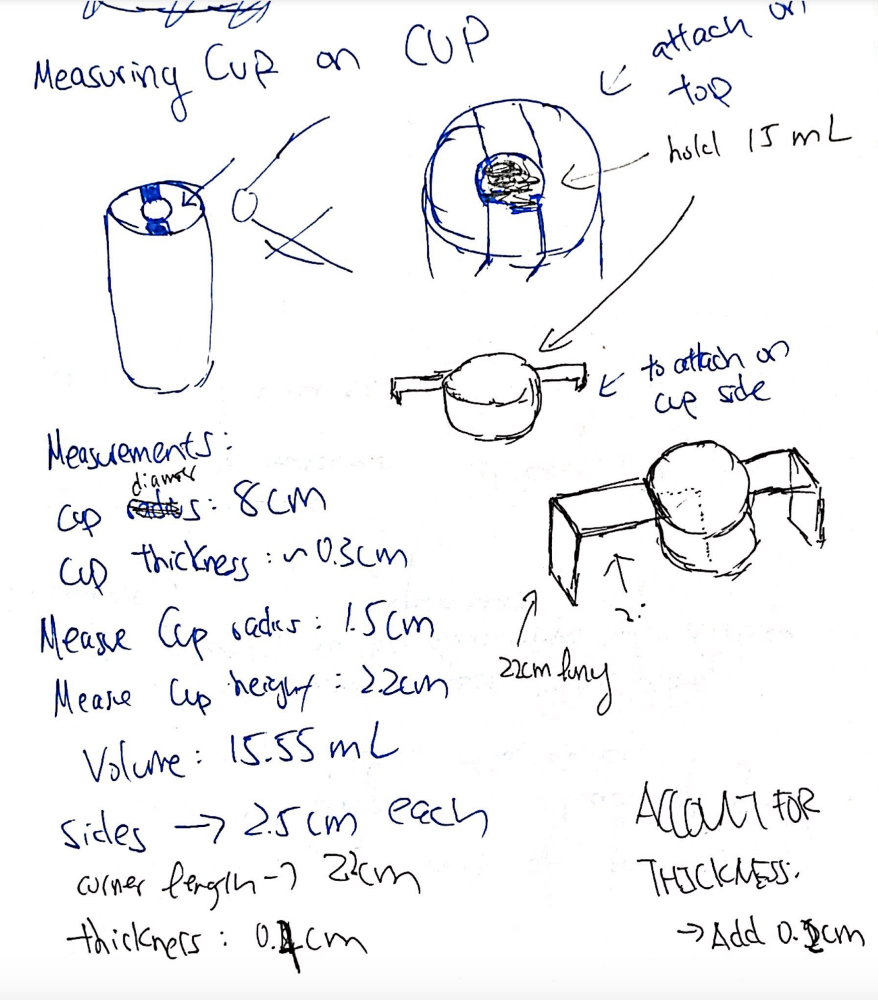

2. Planning

To plan this project, I had to obtain a few measurements of the cup. The cup's diameter is arund 8 cm long with a thickness of 0.8cm. I decided to design my tablespoon measuring cup to be 3cm in diameter and 2.2cm in height (around 15.5ml). To account for thickness (0.2cm) I added 0.1cm for the shell. The final measurements of the cylinder were 1.6cm radius and 2.3cm height. I also made the handles 2.6cm long. Lastly, the corner sides are the same height as the cylinder height.

3. Modeling

I first started by cylinder. I then extruded it and applied the shell onto the top. The shell thickness is 0.2cm thick.

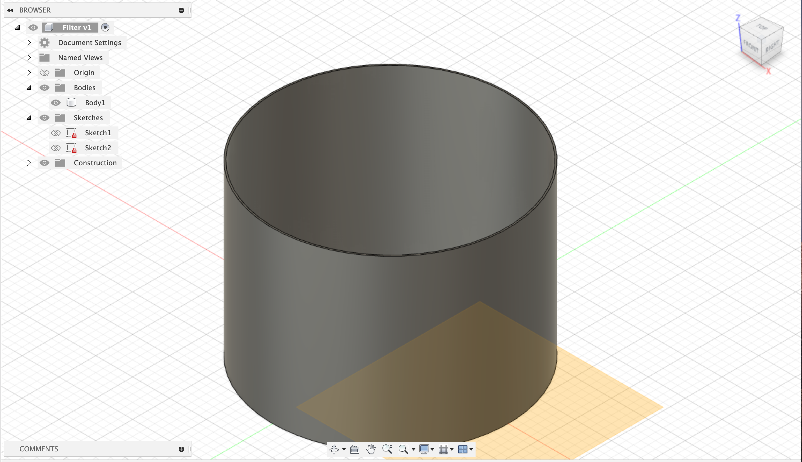

I then added a plane on the top of the cylinder using offset plane then raising it by 2.3cm. I drew the rectangle that was 2.6cm by 1cm. It overlapped with the cylinder so I extruded it by -2mm and then used the join operation.

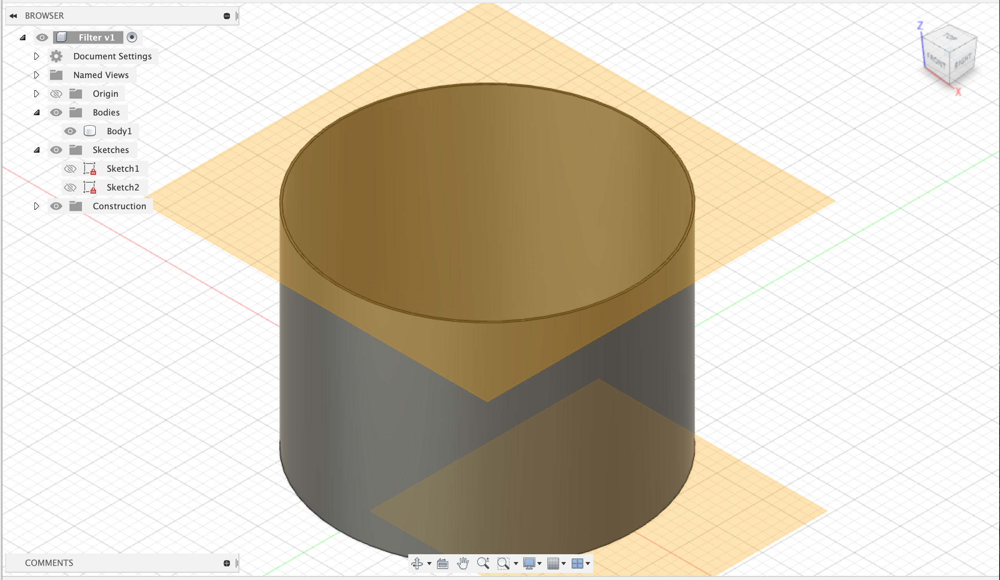
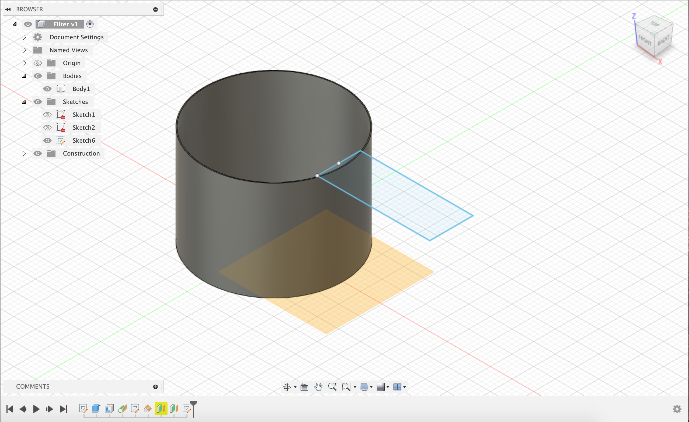
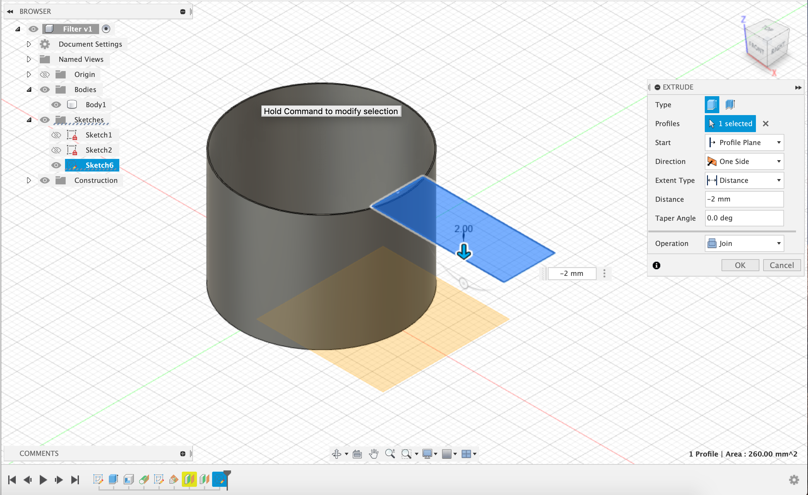

To complete the corner, I used another offset plane on the handle. I then drew a rectangle that was 1cm x 2.3cm. I did the same process as above and extruded it inwards by 1mm and then used the join operation.

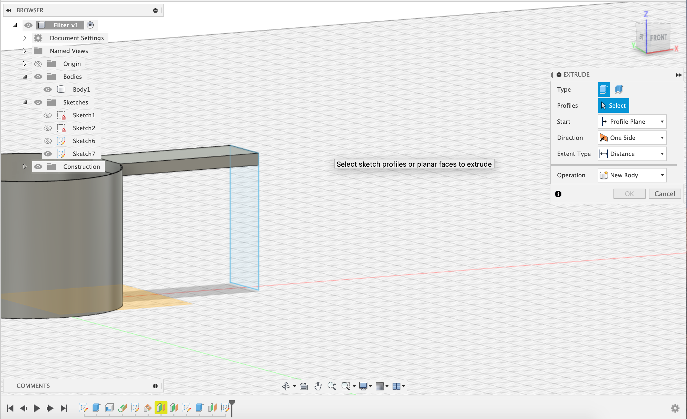
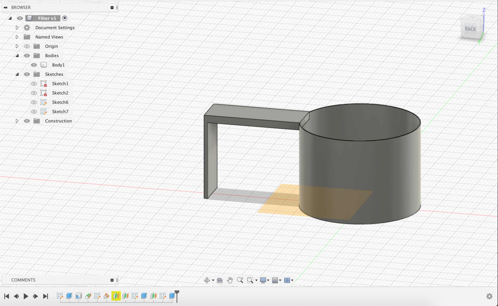

I then just did the same thing for the other side.

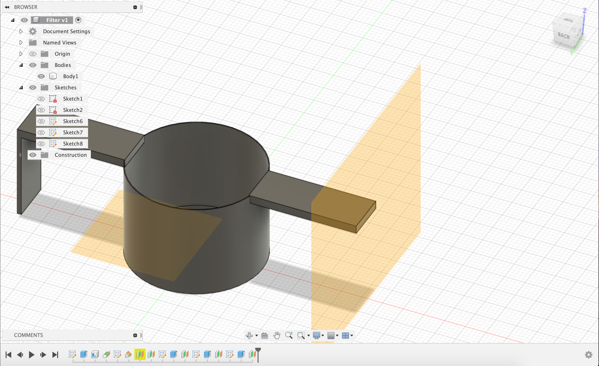
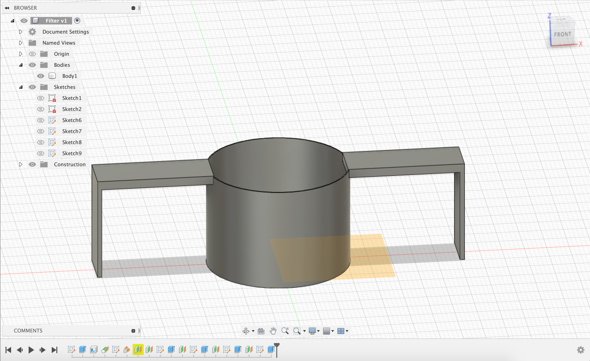

4. Printing

The printing process did not go well. Halfway through the printing, I realized that I needed a support for the handles. This resulted in massive overhangs. Additionally, my cylinder was not printed; it only printed the sides and then the bottom of the cylinder.

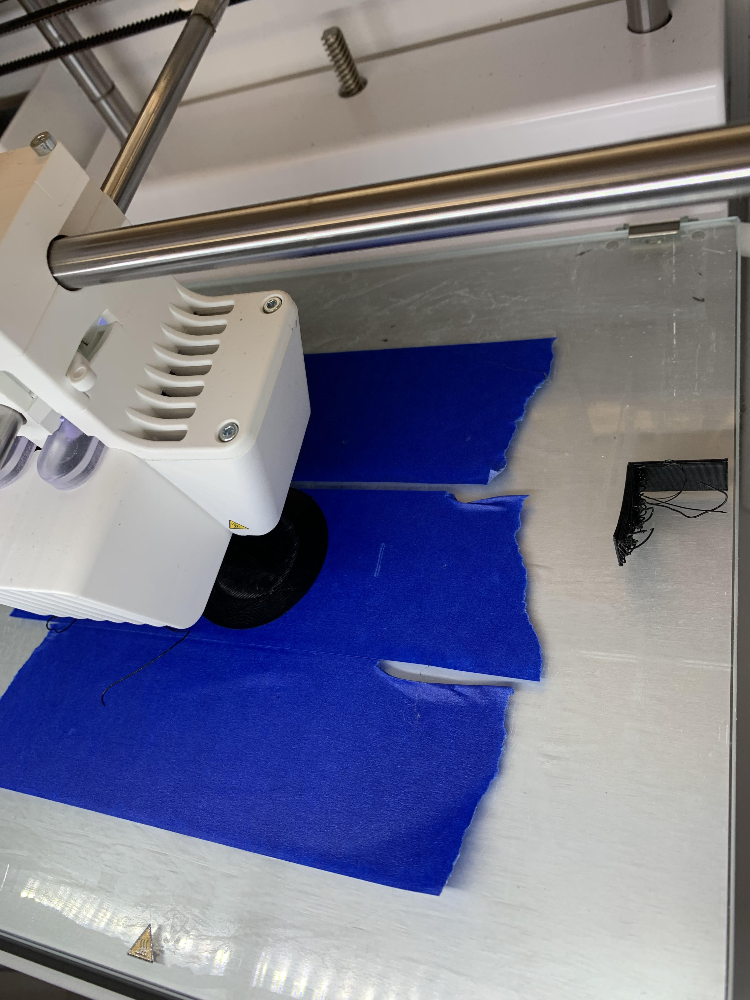
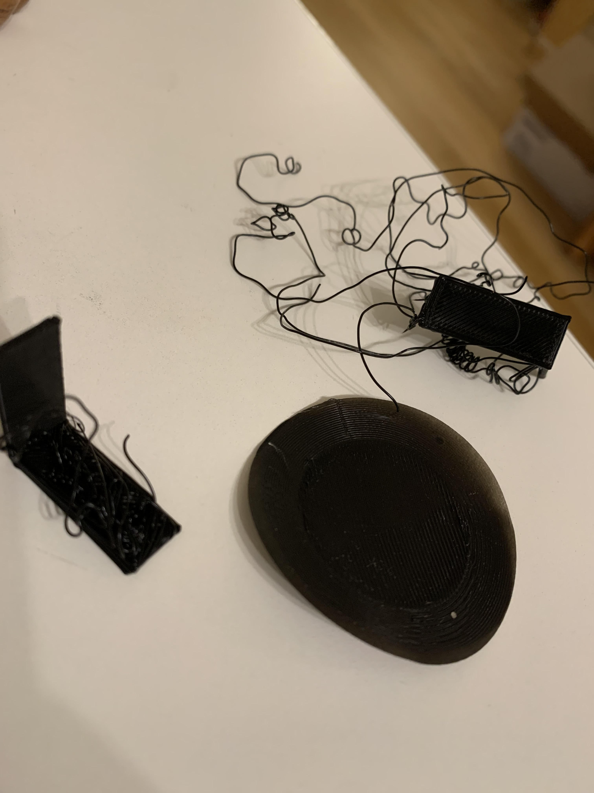

5. Reflecting

Looking back, there were a few changes I needed to make. Although I didn't know why the cylinder didn't print, I changed my approach to this design. Instead of using a cylinder, I would use a hemisphere instead. I hollowed it out with a wall thickness of 1mm. Using the formula 2πr^3/3, I found that 1.9cm radius is sufficient. To account for wall thickness, I created a hemisphere with a radius of 2cm. Instead of having the corner legs, I decided to remove them entirely and just have the handles. The process of modeling this was similar to the first approach.

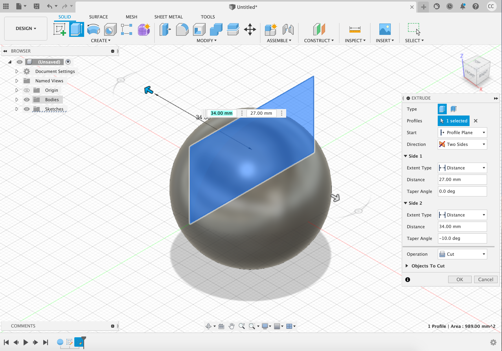
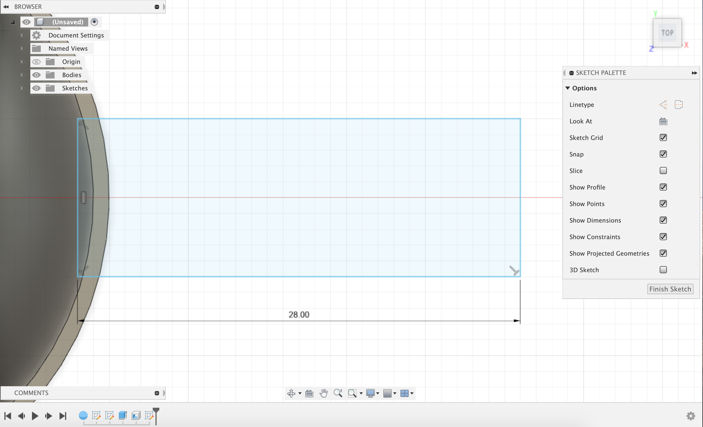
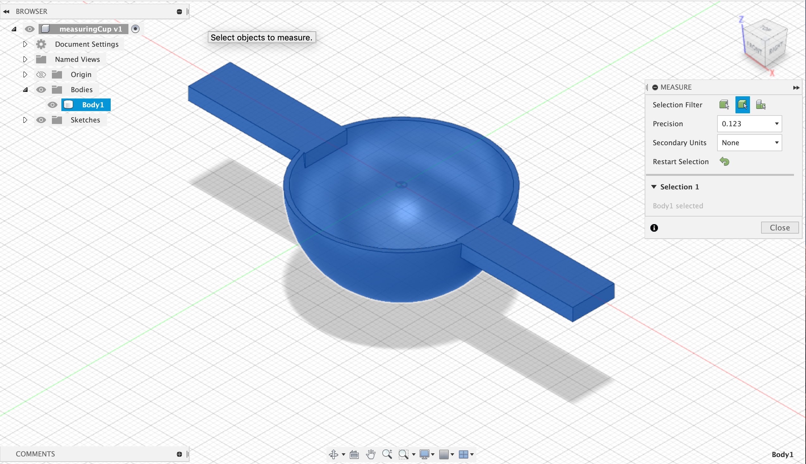
