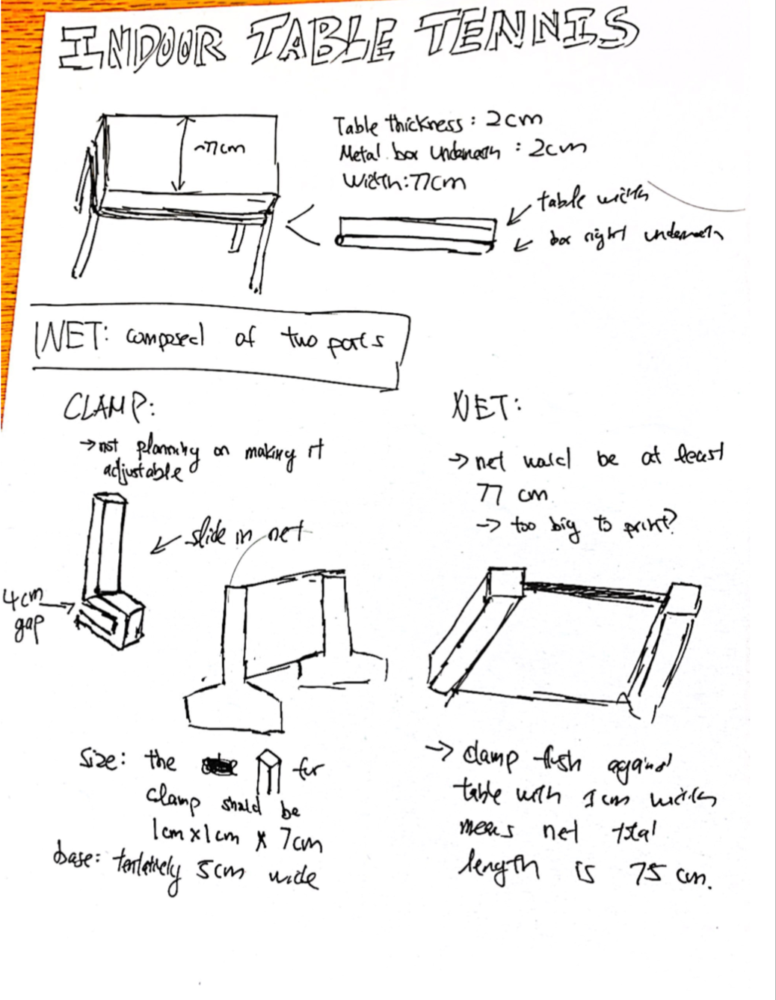
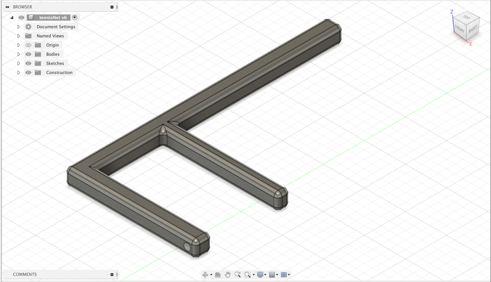
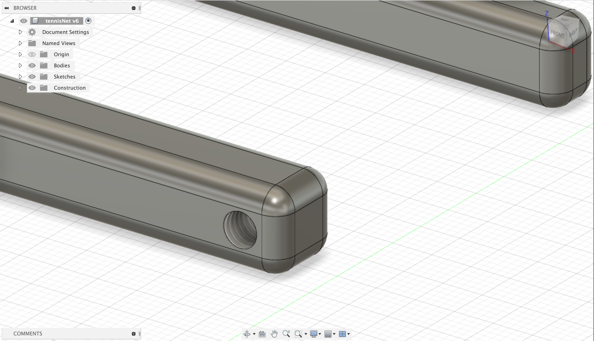
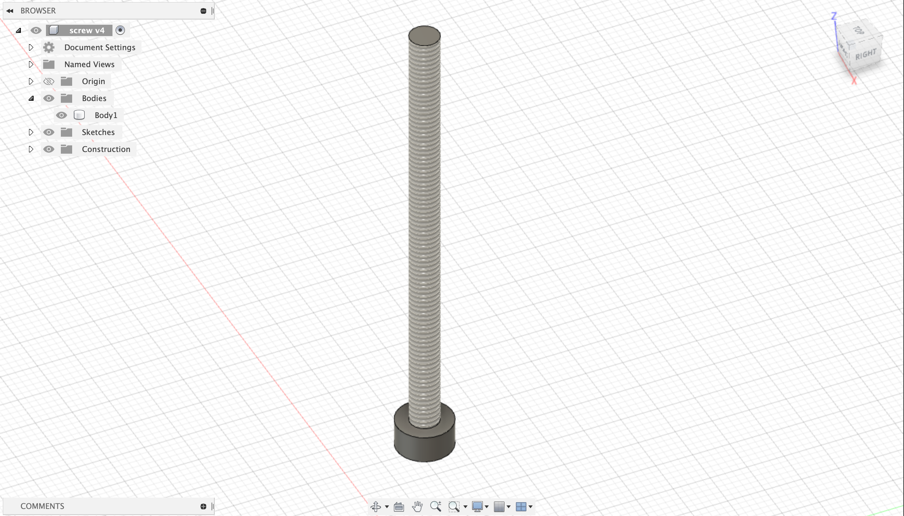

# Assignment 4

Final Project Ideation

1. Idea

Since we have a small table in our living room, I wanted to make a small table tennis set for it. This would involve a clamp, net(?), and potentially paddles.

2. Planning

I measured the the table and obtained the following measurements: 2cm in table thickness, 2cm in bar thickness, and 77cm in width. This table has its legs as one long metal bar that is attached directly below the edge of the table. Thus, instead of 2cm in table thickness, the net clamp should be at least 4cm thick to account for the bar as well. Additionally, I'm not sure if the printers are able to print long objects. If they are unable to print ~77cm in length, I should look for alternatie methods. I plan to make the clamp's net holder to be 1cm x 1cm x 8cm. The net should slide into the net holder and its length will be 75cm (to account for the net holder on both sides) in total. The breakdown of the net would be the part that slides into the net holder with measurements 1.2cm x 1.2cm x 8.2cm and the "net" will be 72.6 cm.

## UPDATES

3. Modeling

I finished modeling the clamp for the net. I decided to create an upside down F shape for the net. The height of the clamp is 16cm in total, with 6cm (4cm for the clamp and 2cm for the thickness) being the base and 10cm for the pole where the net slides in. I also decided to try threading, adding a small hole on the bottom of the net clamp. The thread is 5mm for the net clamp and the radius is 2.1mm. I then tried making the screw. When I tried to use the same thread length, it had a different radius (2.4) from the one on the net clamp. I downsized the thread length on the screw to 4mm but I'm not sure if that will work.

