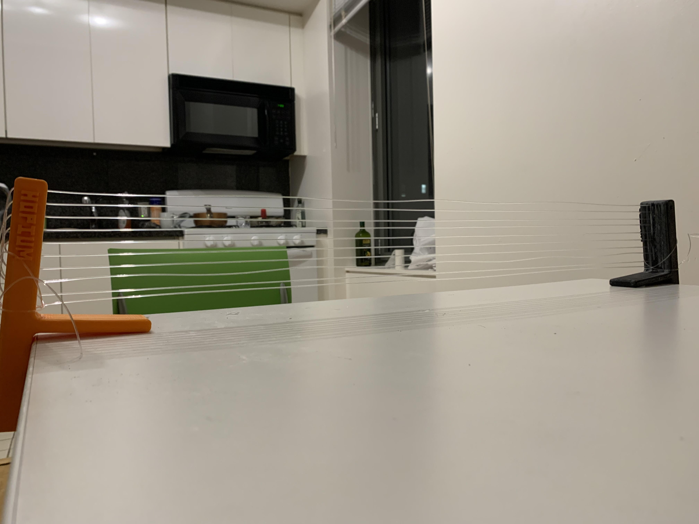
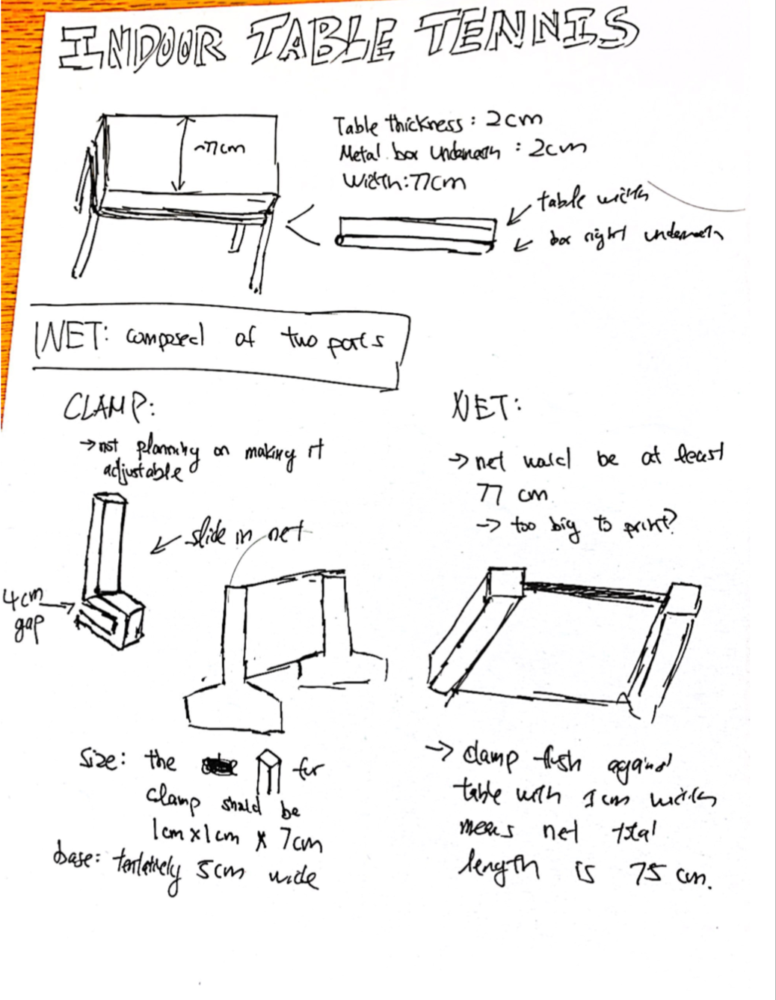
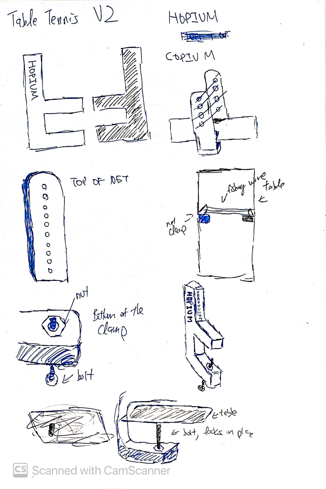
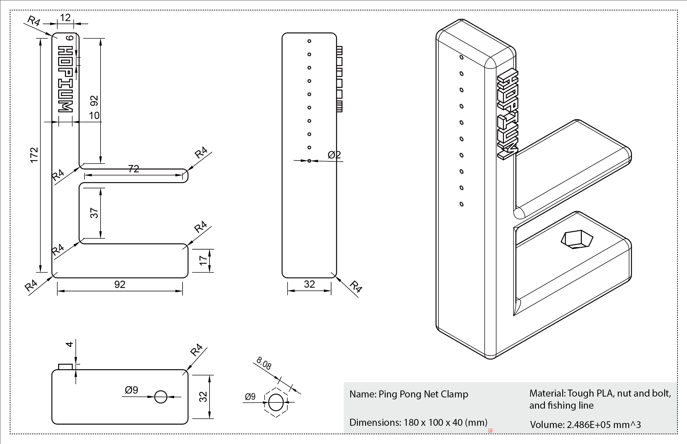
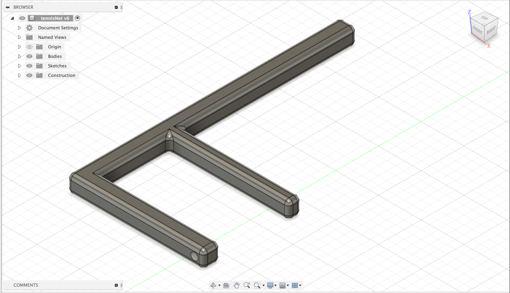
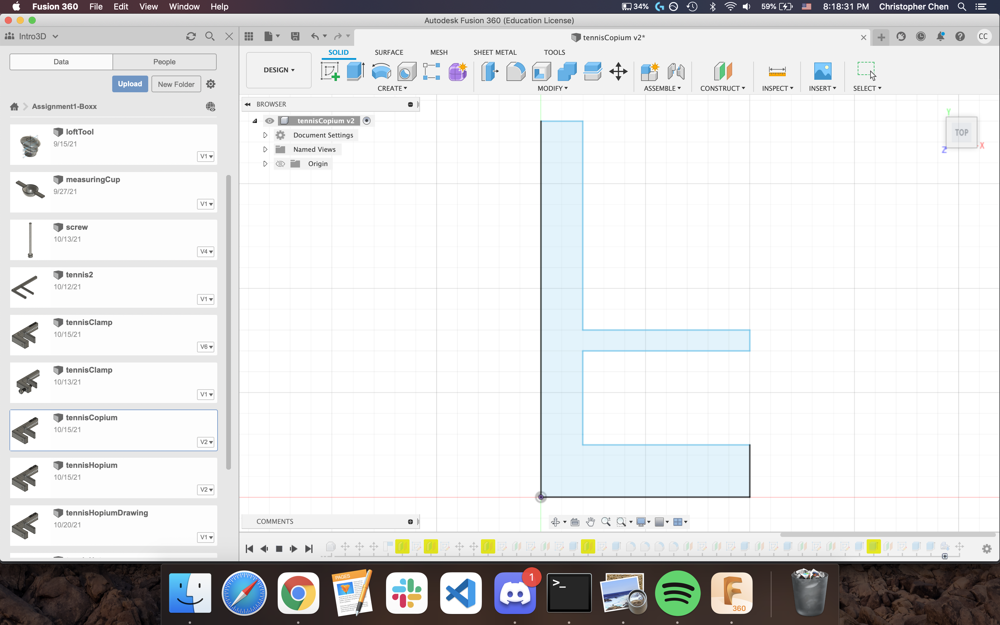
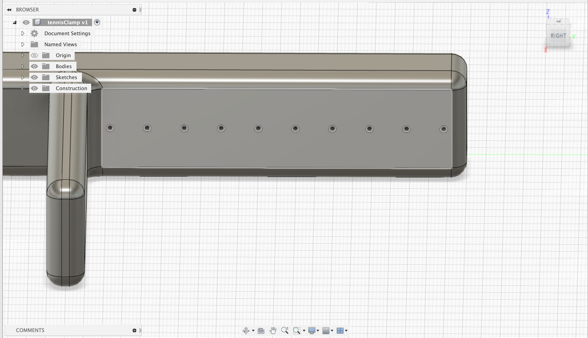
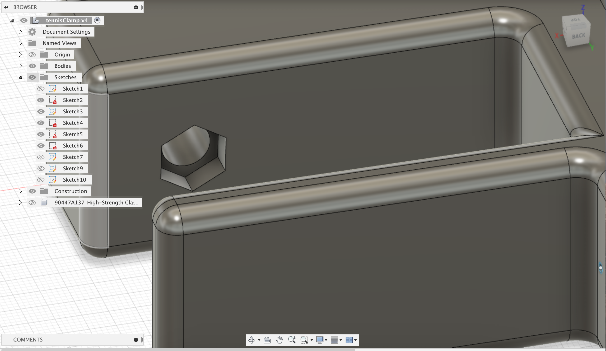

# Final Project

For the final project, I created a ping pong table net clamp that utilizes a nut and bolt to screw it in place and a fishing line as the net. A photo of the net is attached below:

Halfway throughout modeling, I realized that it was not ideal to print out the net; it would require a lot of material and time. Thus, I decided to make small holes in the net clamp instead and use a fishing line to thread the holes. After talking with the professor, I also learned that it was not a good idea to 3D print the threading for the screw as the Ultimakers are not suitable for such precise work. To circumvent this, I decided to use nuts and bolt to lock the clamp in place. To do so, I created a hole that is slightly wider than the bolt so I could slide it in from the bottom easily. I then created a hexagonal hole on the other side so that I could put the nut in it, allowing the bolt to be locked in. 

After I printed the first net clamp, I realized that I printed it with the support material. This meant that the holes were filled, making it nearly impossible to remove. The holes for the net could be resolved using a drill and I used a drill press to create the hole for the bolt. However, I was stuck on removing the hole for the hexagonal nut. Having learned from this, I printed the second net clamp without support and it turned out perfectly fine. I was unable to print the net clamp again (without support) due to time constraints. 

I have attached the sketches and layout drawings below. 

## Creating Process

To create the model for my ping pong table clamp, I first used the sketch tool to draw it out. It follows a simple F shape. In the first iteration, the clamp was not particularly thick. 

The professor suggested I bulk it up, so I increased the thickness of both of the clamping parts along with the overall thickness of it. 

I then rounded out the corners with the fillet tool and then drilled holes in the top portion of the clamp for the fishing line to thread through. 

After I did that, I needed to create a hole for the bolt and the nut. I created a plane on the bottom portion of the clamp and then drew a circle. I used the extrude tool to create the hole and then I used the hexagonal tool to create a hexagon with the same centre of the circle. I also used the extrude tool to cut in the material, allowing the nut to sit in there snugly. 

The modeling process wasn't too intricate, but the result was much better than I had hoped for. 

